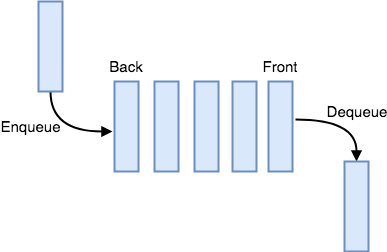

# Queues

## Introduction

Queues is a simple data structure that follows the principle “First In First Out” (FIFO). Just how you would line up in an ordinary queue at a fast food restaurant, the first one in the queue is served first and is the first out of the line after being served. 

Just like the example, queues follow this principle and we can see this in the diagram below



In this diagram we use a few key terms such as “Enqueue” and “Dequeue”
-	Enqueue refers to adding a new element to the back of the queue
-	Dequeue refers to removing the front element out of the queue

## Operations

_Enqueue_
We can add a new value to the back of the queue by using the append function
In Python, this can be written as:

``` python
my_queue.append(value) 
```

The Big O notation for this is O(1) - Performance of adding to the end of the dynamic array

_Dequeue_
We can remove the value at the front of the queue by using the pop function
In Python, this can be written as:

``` python
value = my_queue.pop(0)
```
The Big O notation for this is O(n) - Performance of obtaining and removing from the beginning of the dynamic array

## Example

``` python

fast_food = Queue()

# Adds three people to the fast food queue
fast_food.enqueue("Matt")
fast_food.enqueue("John")
fast_food.enqueue("Sarah")

# Removes the person at the front from the fast food queue
person = fast_food.dequeue()
print(person) # Matt
person = fast_food.dequeue()
print(person) # John
person = fast_food.dequeue()
print(person) # Sarah

```
## Problem to Solve

Now have a try at solving the following problem! This problem asks to fix the fruit list by removing values from the list. 

[Fruits](fruits.py)

Check the solution once you're done!

[Fruits solution](fruits_solution.py)