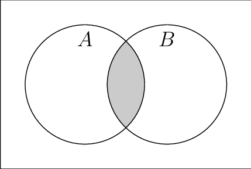

# Sets

## Introduction

Sets are used to store multiple values in a single variable. They are an unordered data type that is iterable, mutable and has no duplicate elements. 

A big advantage of sets compared to lists is that it has an optimized method for checking whether a specific element is contained in the set.

## Application

Some uses of sets are:

- Finding unique values in a list
- Providing fast access to unique results previously calculated
- Performing mathematical set operations such as an intersection and union



## Operations

_Add_

We can add a new value to the set by using a add function. 
In Python, this can be written as:

``` python
my_set.add(value) 
```

The Big O notation for this is O(1) - Performance of hashing the value

_Remove_

We can remove the value from the set by using a remove function. 
In Python, this can be written as:

``` python
my_set.remove(value) 
```

The Big O notation for this is O(1) - Performance of hashing the value

## Example

Here is how a set is used when adding items to a set: 

``` python
days = set(["Mon","Tue","Wed","Thu","Fri","Sat"])
 
days.add("Sun")
print(days) # This will output all the days of the week
```
We can perform a union and intersection operation on two sets like so:

``` python
weekdays = set(["Mon","Tue","Wed","Thu","Fri"])
weekends = set(["Fri","Sat","Sun"])
all_days = union(weekdays, weekends) # This will output all the days but Fri just once
one_day = intersection(weekdays, weekends) # This will output just Fri since it is in both sets
print(all_days) 
print(one_day)

```

## Problem to Solve

Now have a try at solving the following problem! Let's sort out this grocery list problem!

[Grocery](grocery.py)

Check the solution once you're done!

[Grocery Solution](grocery_solution.py)


## [Back To Home](0-welcome.md)