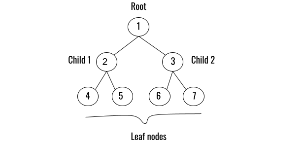
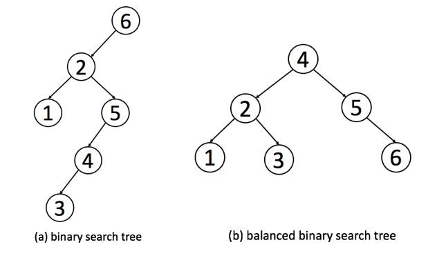

# Trees

## Introduction

Trees are non-linear data structures that represent nodes connected by edges. They are used for searching and data organization. A tree can connect to multiple different nodes. 

## Binary Trees 

Key Terms

Root - The root of a binary tree is at the top and there is only one

Parent - The parent of a node is one level above of a node

Child - The children of a node are the nodes a level below the node

Leaf - The leaves of a binary tree are the nodes with no children


Here we can see a diagram of a binary tree: 



## BST 

A binary search tree (BST) is a binary tree that follows the rules for data placed into the tree. Data is placed into the BST by comparing data with the value in the parent node. 

If the data is less than the parent node, it goes into the left subtree. If the data is greater than the parent node, it goes into the right subtree. 

If duplicates are allowed, they can go in the left or right of the root. 

## Balanced BST
A balanced binary search tree is a BST where the height between any two subtrees is evenly distributed. The height of a tree can be found by counting the max number of nodes between the root and leaves. 



## Operations

_Insert_

We can insert a value into the tree.

``` python
insert(value) 
```

The Big O notation for this is O(log n) - Recursively search the subtrees to find the next available spot

_Remove_

We can remove a value from the tree.

``` python
remove(value) 
```

The Big O notation for this is O(log n) - Recursively search the subtrees to find the value and then remove it. This will require some cleanup of the adjacent nodes.

_Contains_

We can determine if a value is in the tree.

``` python
contains(value) 
```

The Big O notation for this is O(log n) - Recursively search the subtrees to find the value.

_Traverse forward_

We can visit all objects from smallest to largest.

``` python
traverse_forward
```

The Big O notation for this is O(n) - Recursively traverse the left subtree and then the right subtree.

_Traverse reverse_

We can visit all objects from largest to smallest.

``` python
traverse_reverse 
```

The Big O notation for this is O(n) - Recursively traverse the right subtree and then the left subtree.

_Height_

We can determine the height of a node.

``` python
traverse_reverse 
```

The Big O notation for this is O(n) - Recursively find the height of the left and right subtrees and then return the maximum height (plus one to account for the root).

## Example

Here is an example of binary tree

``` python
# This is the node class
class Node:

    def __init__(self, data):
        # This is the left child
        self.left = None
        # This is the right child
        self.right = None
        # This is the node's value
        self.data = data

    # This is the print function
    def PrintTree(self):
        print(self.data)

root = Node(24) # The output will give us 24

root.PrintTree()

```

## Problem to Solve

Now have a try at solving the following problem! Let's sort out this binary tree!

[Binary](binary.py)

Check the solution once you're done!

[Binary Solution](binary_solution.py)


## [Back To Home](0-welcome.md)